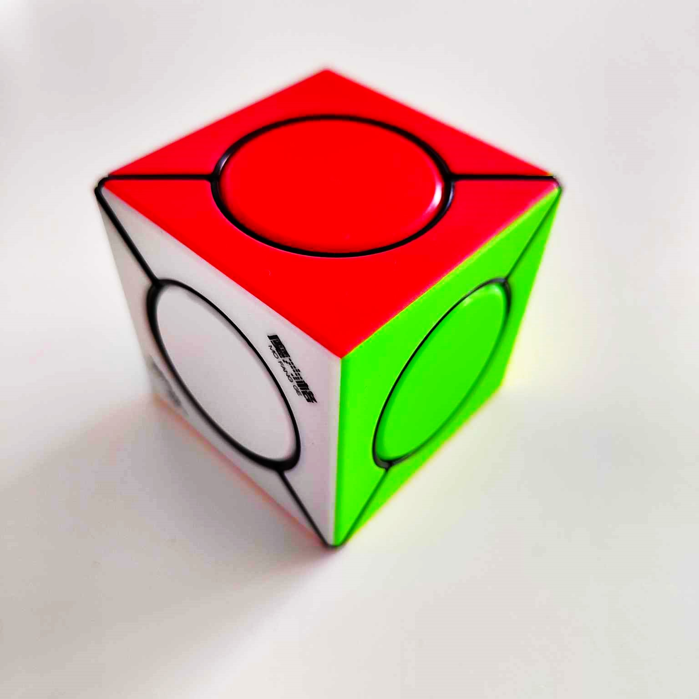
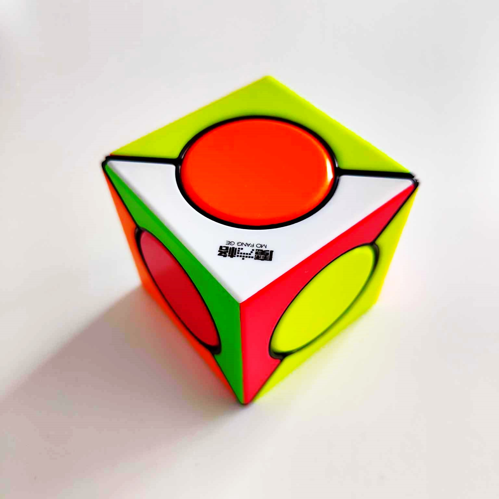

# Optimal Solver for the Six Spot Cube
## MiniZinc model created for finding shortest solution for David Pitcher's Six Spot Cube.

### Cube:
<p float="left">
  
   
</p>

### Example Configuration:
```
corners_rotation = [1, 0, 0];
spot_colors = [Yellow, White, Green, Orange, Red, Blue];
MAX_MOVES = 10;
```

### Solved Configuration:
```
corners_rotation = [0, 0, 0];
spot_colors = [Red, White, Green, Orange, Blue, Yellow];
MAX_MOVES = 20;
```